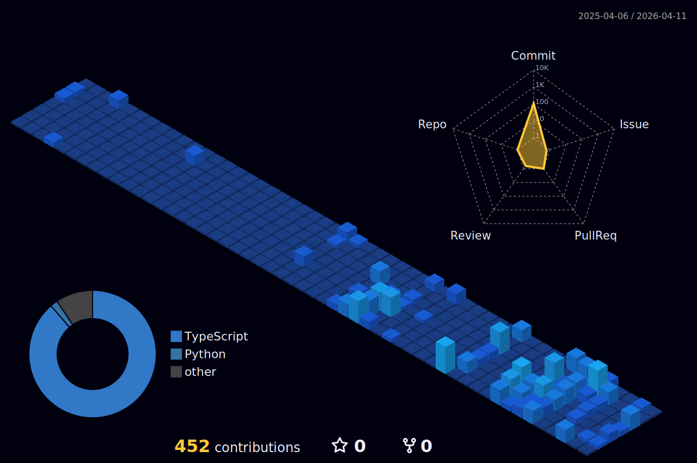

# Hi, I'm Anthony Benacquisto 👋

Just a software engineer focused on AI agents, memory systems, and local-first software. I enjoy problem-solving, building things, and experimenting with new technologies.

Here’s what I’m currently building:
- 🧠 **[AgentBigBrain](https://github.com/AgentBigBrain/AgentBigBrain):** a local-first AI agent built around a Society of Mind-style cognitive architecture.
- **Temporal memory for AI agents:** designing a graph-backed memory system that helps the agent retain context, reason over prior conversations, and distinguish current truth from history over time.

