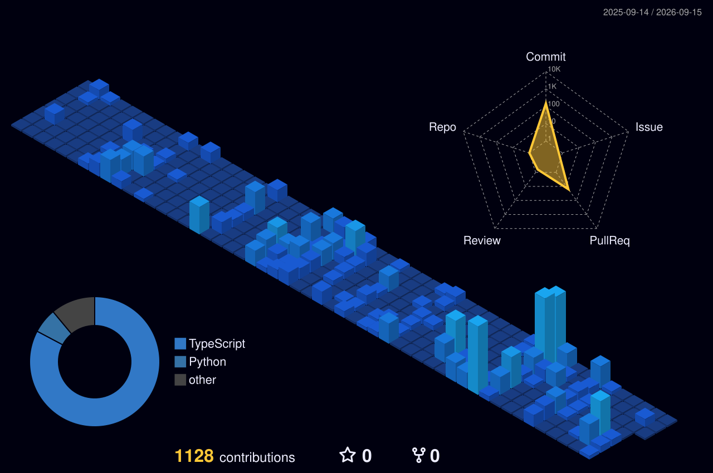

#  Hi, I'm Anthony Benacquisto

**Software engineer and computer science student building local-first AI systems.**

My work focuses on AI agents, memory systems, and modular cognitive architectures—particularly software that can reason, retain context, coordinate specialized components, and remain under the user’s control.

## What I'm Building

- 🧠 **[AgentBigBrain](https://github.com/AgentBigBrain/AgentBigBrain):** A local-first AI agent based on a Society of Mind-inspired cognitive architecture, designed to explore persistent memory, specialized cognitive components, and coordinated agent behavior.

## Current Interests

`AI Agents` · `Memory Systems` · `Local-First Software` · `Agent Orchestration` · `Web Architecture`

